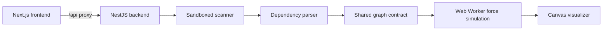

# CodeMap

CodeMap is a local-first codebase explorer. It maps files and dependencies into
an interactive canvas so developers can inspect structure, trace relationships,
and eventually ask grounded architectural questions.

## Current UI

The frontend currently provides a force-directed canvas with pan, zoom,
selection, search, and an import inspector. A captured local preview belongs at
`docs/images/graph-visualizer.png`; generate it after starting both apps using
the commands below. This keeps documentation screenshots representative of the
running build rather than a design mock-up.

## Architecture



- `apps/frontend`: Next.js application and canvas-based graph viewer.
- `apps/backend`: NestJS API that safely scans an allowed workspace and creates
  dependency graph data.
- `packages/shared`: TypeScript contracts shared by the backend and frontend.
- `docs`: product requirements, SRS, and architecture decision records.

The frontend expects the backend at `http://localhost:3001` through its local
`/api` rewrite. This is a local development architecture; do not expose a
filesystem-scanning API to untrusted remote users.

## Prerequisites

- Node.js 22 (see `.nvmrc`)
- pnpm 10.20.0 (declared in `package.json`)

## Quick start

```bash
corepack enable
pnpm install --frozen-lockfile
cp apps/backend/.env.example apps/backend/.env
pnpm --filter backend dev
```

In a second terminal:

```bash
pnpm --filter @codemap/frontend dev
```

Open `http://localhost:3000`. Configure `PORT=3001` in
`apps/backend/.env` so it matches the frontend proxy. Set `WORKSPACE_ROOT` to
the absolute directory the backend is allowed to scan.

## Common commands

```bash
pnpm dev           # start workspace development scripts
pnpm lint          # run ESLint checks
pnpm format:check  # run Prettier checks in every package
pnpm test          # run test suites
pnpm test:cov      # run coverage where configured
pnpm build         # build every package
```

Use `pnpm --filter backend test` and
`pnpm --filter @codemap/frontend dev` for package-specific commands.

## Threat model

The highest-risk boundary is repository ingestion. CodeMap must treat the target
repository and its contents as untrusted input.

- Restrict scanning to an explicit allowed workspace root.
- Resolve real filesystem paths and reject traversal and symlink escapes.
- Ignore generated/vendor directories and enforce extension, file-size, file-
  count, depth, and time limits.
- Never expose filesystem paths or scanning endpoints to unauthenticated remote
  clients.
- Treat source code as untrusted context in AI prompts; minimize context,
  prevent prompt-instruction override, and require explicit consent before
  sending code to an external provider.

See [SECURITY.md](SECURITY.md) for reporting guidance and
[docs/adr](docs/adr/README.md) for architectural decisions.

## Contributing

Read [CONTRIBUTING.md](CONTRIBUTING.md) before opening a pull request. Code is
released under the [MIT License](LICENSE).
