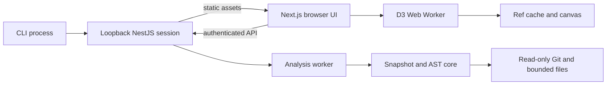

# CodeMap

CodeMap reviews the scope and dependency consequences of code changes in a local
browser. Declare the files or folders a task was meant to change, then inspect
scope exceptions, added and removed imports, new cyclic groups, and captured text
diffs alongside an interactive dependency map.

The first release targets JavaScript/TypeScript repositories through an npm CLI.
The implementation, clean-package installation, and Chromium browser tests pass
on Linux. Native macOS/Windows results remain pending in the CI matrix; see the
[release roadmap](docs/roadmap.md). No npm release has been published.

## Try the local build

Requires Node.js 22+, Git, and pnpm 10.20.0.

```bash
corepack enable
pnpm install --frozen-lockfile
pnpm build
node packages/cli/bin/codemap.cjs review --base main
```

Run from the Git repository root. To review a different repository, change to its
root and invoke the CLI using the absolute path to `packages/cli/bin/codemap.cjs`.
The base must exist locally and share a unique common ancestor with HEAD.

The CLI opens an authenticated URL on `127.0.0.1`. Keep that session URL private;
Ctrl+C stops the server. Use `--no-open` to open the printed URL yourself. Select
scope in the browser or pass repeated options such as `--scope src/auth/`.
Folder scopes end in `/`.

Reviews compare the merge base with final working files, including branch
commits, staged/unstaged edits, and non-ignored untracked files. Refresh captures
new content and preserves scope. No source is uploaded, no code is executed, and
no checkout, staging, or fetch is performed. AI credentials are not required.

## Architecture


```mermaid
flowchart LR
  CLI[CLI process] --> API[Loopback NestJS session]
  API -->|static assets| UI[Next.js browser UI]
  UI -->|authenticated API| API
  API --> Analysis[Analysis worker]
  Analysis --> Core[Snapshot and AST core]
  Core --> Git[Read-only Git and bounded files]
  UI --> Physics[D3 Web Worker]
  Physics --> Canvas[Ref cache and canvas]
```

- `packages/core`: Git snapshots, bounded file reads, AST resolution and graph comparison.
- `apps/backend`: authenticated review, refresh and captured-diff APIs; worker lifecycle.
- `apps/frontend`: static review UI, scope selection, canvas and physics worker.
- `packages/shared`: graph, worker and review contracts.
- `packages/cli`: command-line entry point and assembled runtime/static assets.

The packaged server does not mount the legacy parser endpoints. See
[ADR-0002](docs/adr/0002-change-review-cli.md) for the new boundaries and
[CLI documentation](packages/cli/README.md) for limits and usage.

## Validation and packaging

```bash
pnpm lint
pnpm format:check
pnpm test
pnpm --filter backend test:cov --runInBand
pnpm --filter @codemap/frontend benchmark
pnpm build
pnpm --filter @codemap/cli exec playwright install chromium
pnpm --filter @codemap/cli pack --pack-destination packages/cli
pnpm --filter @codemap/cli test:packed codemap-cli-0.1.0.tgz --browser
```

The smoke test installs the tarball in a temporary project, checks authenticated
API/static assets and refresh, and verifies SIGINT/SIGTERM shutdown on Unix
(forced process termination on Windows). It may download runtime dependencies
from npm. `--browser` runs Chromium against that installed CLI: scope, diffs,
refresh, search, pointer/keyboard controls, resize, changing pixel density, and
the 1,000-node/3,000-edge canvas. The same package/browser checks are configured
for Linux, macOS and Windows in CI.

Browser regression budgets are mean frame interval <34 ms and p95 <60 ms on the
headless fixture; timings vary by machine and are not a universal 60 FPS claim.
The separate worker benchmark measures physics, message rate, quadtree lookup
and main-process heap usage. Browser heap figures exclude worker memory.

## Analysis limits

Import connections describe structure, not demonstrated runtime behavior.
Unsupported files, unresolved dependencies, symlinks and oversized files are
reported. Renames initially appear as deletion plus addition. Current-file reads
are rechecked individually; the entire repository is not captured atomically
while other processes are editing it. Review source ingestion as an untrusted
input boundary; keep the server local.

See [SECURITY.md](SECURITY.md) for reporting guidance and
[CONTRIBUTING.md](CONTRIBUTING.md) for contributions. Code is released under the
[MIT License](LICENSE).
