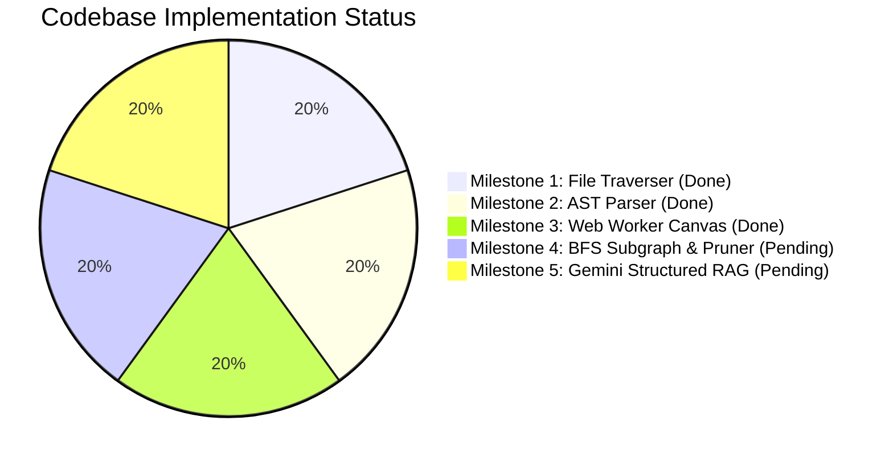
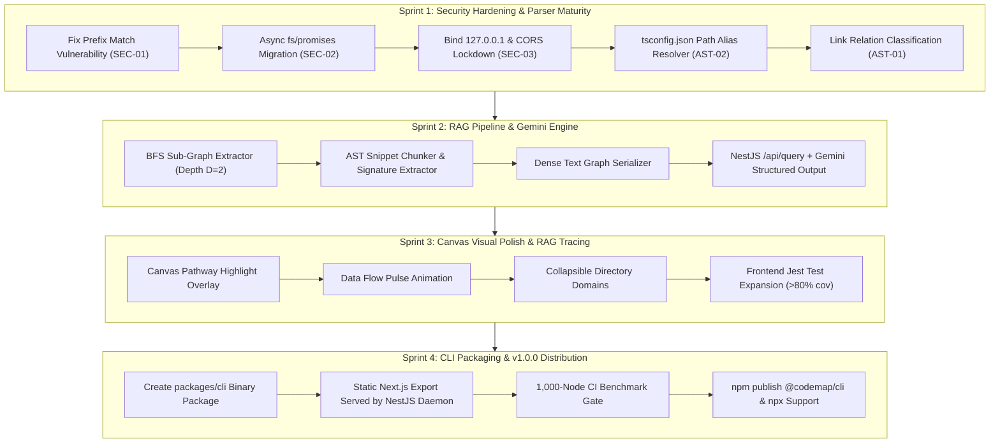

# CodeMap (CodeGraph) — Architectural Audit, Analysis & Strategic Roadmap

**Audit Date:** September 28, 2026  
**Auditor:** Senior AI Software Engineer & System Architect  
**Target Monorepo:** `codemap` (`apps/backend`, `apps/frontend`, `packages/shared`, `docs/`, `.agents/`)  
**Current Milestone State:** Phase 3 Complete (Worker Physics & Canvas Decoupling)  

---

## 1. Executive Summary & Health Scorecard

CodeMap is an open-source, local-first interactive codebase dependency visualizer and semantic RAG exploration platform designed to be distributed as an NPM CLI.



### Overall Health Score: **B+ (84/100)**

| Dimension | Score | Assessment | Key Concern |
| :--- | :---: | :--- | :--- |
| **System Architecture** | **A (92%)** | Clean package isolation; D3 Web Worker offloads simulation mathematics; AST abstractions behind clean interfaces. | Lack of domain clustering/collapsing on canvas. |
| **Security & Sandboxing** | **B (78%)** | Strong containment tests and boundary concepts, but critical path prefix-matching bugs and server binding issues exist. | Substring `.startsWith()` checks; unconstrained CORS and `0.0.0.0` default binding. |
| **Parsing & Fidelity** | **B (82%)** | TypeScript Compiler API accurately resolves static imports, dynamic calls, and JSON files without regex fragility. | Hardcoded link relations; missing `tsconfig.json` path alias resolution. |
| **Frontend Performance** | **A- (88%)** | Physics offloaded to worker via `Float32Array`; `requestAnimationFrame` loop decoupled from React; sub-10ms Quadtree hover detection. | Canvas DPR resizing quirks; lack of visual UI component tests. |
| **AI / RAG Capability** | **Incomplete (0%)** | Architecture specified in SRS, but implementation has not started. | Milestones 4 and 5 are completely pending. |
| **Distribution & CLI** | **Incomplete (10%)** | ADR-0001 accepted, but `@codemap/cli` package wrapper does not yet exist. | Monorepo requires manual clone and `pnpm dev`. |

---

## 2. Security & OWASP Audit Findings

### Finding SEC-01: Path Traversal via Prefix Confusion (A01: Broken Access Control) — **High Severity**
* **Locations:**
  * `apps/backend/src/parser/file-scanner.service.ts` (Line 107)
  * `apps/backend/src/parser/typescript-ast-extractor.service.ts` (Line 149)
* **Vulnerability Analysis:**
  Both services validate whether physical paths reside inside `workspaceRoot` using:
  ```typescript
  if (!realPath.startsWith(workspaceRoot)) { ... }
  ```
  If `workspaceRoot` is `/home/user/project`, a symlink pointing to `/home/user/project-secret/keys.env` will evaluate to `true` because of prefix matching. This directly violates SRS Section 4.1 and `.agents/AGENTS.md`.
* **Remediation:** Replace with strict relative path containment verification:
  ```typescript
  const rel = path.relative(realRoot, realTarget);
  const isSafe = rel === '' || (!rel.startsWith('..') && !path.isAbsolute(rel));
  if (!isSafe) {
    return null; // or reject
  }
  ```

### Finding SEC-02: Synchronous File I/O in Async Pipeline — **Medium Severity**
* **Locations:**
  * `apps/backend/src/parser/security.service.ts` (Lines 26, 29, 36, 37)
  * `apps/backend/src/parser/file-scanner.service.ts` (Lines 64, 65)
* **Vulnerability Analysis:**
  `fs.existsSync`, `fs.realpathSync`, and `fs.readFileSync` are called directly inside NestJS controllers and services. On large repositories (50,000+ files), synchronous I/O blocks the Node.js event loop, causing server lag and potential DoS (A04).
* **Remediation:** Migrate all file system operations to `fs/promises` (`access`, `realpath`, `readFile`).

### Finding SEC-03: Network Exposure & Open CORS (A05: Security Misconfiguration) — **High Severity**
* **Location:**
  * `apps/backend/src/main.ts` (Lines 6-7)
* **Vulnerability Analysis:**
  ```typescript
  app.enableCors(); // Unrestricted CORS: allows any Origin
  await app.listen(process.env.PORT ?? 3001); // Binds to 0.0.0.0 in Express/Node
  ```
  This exposes the filesystem scanning endpoint (`/api/graph?path=...`) to the entire local network. Furthermore, any malicious website opened in the user's browser can issue cross-origin requests to `http://localhost:3001` and silently scrape the user's private local codebase.
* **Remediation:**
  1. Bind strictly to `127.0.0.1`: `await app.listen(port, '127.0.0.1');`
  2. Restrict CORS origins to trusted frontend origins (`http://localhost:3000`).
  3. Implement startup session token authentication (per AGENTS.md A07).

---

## 3. AST Parser & Compiler Audit Findings

### Finding AST-01: Hardcoded Link Relations
* **Location:** `apps/backend/src/parser/typescript-ast-extractor.service.ts` (Line 55)
* **Analysis:** All extracted links are created with `relation: 'static-import'`. While the visitor correctly inspects `require(...)`, dynamic `import(...)`, and export statements, it does not set `'dynamic-require'` or distinguish `'type-import'`, losing valuable semantic metadata defined in `@codemap/shared`.

### Finding AST-02: Missing Module Alias & Path Resolution
* **Location:** `apps/backend/src/parser/typescript-ast-extractor.service.ts` (Line 41)
* **Analysis:** Imports are only resolved if they start with `.` or `/`:
  ```typescript
  if (imp.startsWith('.') || imp.startsWith('/'))
  ```
  Projects using `tsconfig.json` path mappings (e.g. `@/components/Button`, `~/utils`) or monorepo workspace packages (`@codemap/shared`) fail to resolve and appear as disconnected or missing nodes in the graph.
* **Remediation:** Parse the target repository's `tsconfig.json` (using `ts.readConfigFile` and `ts.parseJsonConfigFileContent`) to resolve `compilerOptions.paths` aliases during import traversal.

---

## 4. Frontend & Canvas Performance Audit Findings

### Finding FE-01: Architecture & Strengths
* **Web Worker Decoupling:** `simulation.worker.ts` successfully calculates D3-force layout physics in a background thread and transmits flat `Float32Array` buffers to eliminate serialization overhead.
* **Non-Blocking Render Loop:** `useGraphState.ts` buffers coordinates in `tickDataRef.current` without triggering React component re-renders on physics ticks, running smooth 60 FPS renders via `requestAnimationFrame`.
* **Spatial Hover Detection:** Node search uses `d3-quadtree`, dropping mouse hover detection complexity to $O(\log N)$ (sub-10ms).

### Finding FE-02: Feature Gaps vs PRD / SRS
1. **Collapsible Directory Domains (PRD Persona B):** Directory nodes do not currently render as expandable/collapsible boundary clusters.
2. **Execution Trace & Pulse Animation (PRD Feature Scope):** The canvas renderer draws static circles and lines; animated payload pulses along edges are not yet implemented.
3. **Frontend Test Coverage:** Only `SearchBar.spec.tsx` and `useGraphState.spec.ts` have tests. `GraphVisualizer.tsx`, `SidePanel.tsx`, `canvasRenderer.ts`, and `useCameraController.ts` lack unit tests.

---

## 5. SRS Milestone Gap Analysis

```
[Milestone 1: File Traverser]       =======> (90% Done - Minor security bugs)
[Milestone 2: AST Parser]           =======> (80% Done - Alias resolution needed)
[Milestone 3: Canvas & Worker]      =======> (85% Done - Domain grouping needed)
[Milestone 4: BFS Subgraph Pruner]  =======> (0% Done - Unstarted)
[Milestone 5: Gemini Structured RAG]=======> (0% Done - Unstarted)
[Packaging: @codemap/cli]          =======> (0% Done - Unstarted)
```

---

## 6. Strategic Future Roadmap



### Detailed Sprint Breakdown

#### Sprint 1: Security Hardening & Parser Maturity (Priority: Critical)
- [ ] **SEC-01 Fix:** Refactor `file-scanner.service.ts` and `typescript-ast-extractor.service.ts` to replace `.startsWith(workspaceRoot)` with `path.relative()` containment checks.
- [ ] **SEC-02 Fix:** Convert `security.service.ts` and `file-scanner.service.ts` to pure asynchronous `fs/promises`.
- [ ] **SEC-03 Fix:** Update `apps/backend/src/main.ts` to bind explicitly to `127.0.0.1` and restrict CORS to `http://localhost:3000`.
- [ ] **AST-02 Enhancement:** Integrate `tsconfig.json` path resolver in `TypeScriptAstExtractorService` to support `@/*` imports.
- [ ] **AST-01 Enhancement:** Categorize links into `'static-import'`, `'dynamic-require'`, and `'type-import'`.

#### Sprint 2: Context Pruning & Gemini RAG Integration (Milestones 4 & 5)
- [ ] **Sub-Graph Extraction:** Build `SubGraphExtractorService` performing a BFS traversal up to depth $D=2$ around seed query nodes.
- [ ] **AST Snippet Chunking:** Implement code snippet extractor that captures exported functions, interfaces, and signatures while pruning internal logic.
- [ ] **Dense Serializer:** Format extracted graph nodes and edges into token-efficient text format.
- [ ] **Gemini API Integration:** Implement `QueryController` (`POST /api/query`) calling `@google/genai` with strict JSON schema response (`QueryResponse`).

#### Sprint 3: Canvas Visual Polish & Tracing
- [ ] **Canvas Pathway Highlighting:** Draw directed glowing bezier routes for node sequences returned by `/api/query`.
- [ ] **Dynamic Pulse Animation:** Render traversing particle pulse animations across dependency edges.
- [ ] **Directory Domain Grouping:** Add D3 cluster forces and visual boundary hulls for folders.
- [ ] **Test Expansion:** Add unit tests for `SidePanel.tsx`, `canvasRenderer.ts`, and `useCameraController.ts`.

#### Sprint 4: Distribution & Packaging (ADR-0001)
- [ ] **CLI Package Setup:** Create `packages/cli` exposing `bin/codemap.js`.
- [ ] **Static Frontend Export:** Configure Next.js static HTML export and serve it directly from the NestJS local server.
- [ ] **Lifecycle Management:** Orchestrate single-port startup, automatic browser opening, and clean shutdown on `SIGINT`.
- [ ] **CI Performance Gate:** Run `benchmark-worker.ts` in GitHub Actions to verify frame times stay below 16ms under 1,000 nodes.

---

## 7. Reusable Master Audit Prompt

Future agents and reviewers can execute the prompt below to re-verify compliance against these standards:

```markdown
Run an architectural and security audit of the CodeMap repository:
1. Verify OWASP compliance (A01 path traversal via path.relative, A05/A07 127.0.0.1 host binding and CORS).
2. Validate that file traversal and AST extraction use async fs/promises and the TypeScript Compiler API.
3. Check Web Worker physics decoupling (Float32Array coordinate transfer, useRef canvas render loop).
4. Audit Gemini RAG readiness (BFS sub-graph extraction, AST signature pruning, dense serialization).
5. Compare current implementation against PRD, SRS, and ADR-0001, providing an updated milestone matrix and prioritized sprint backlog.
```
