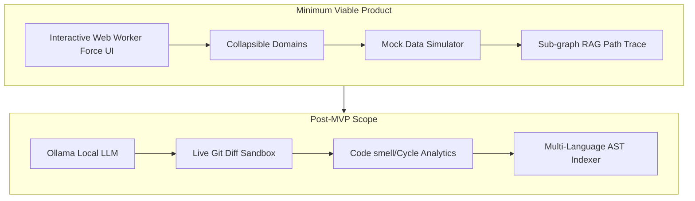

# Product Requirements Document (PRD): CodeMap (CodeGraph)

## 1. Executive Summary & Vision

**CodeMap (CodeGraph)** is an interactive, visual codebase mapping tool designed to streamline developer onboarding, facilitate architectural analysis, and enable contextual codebase querying. It represents a software repository as an interactive, directed graph where nodes represent files and directories, and edges denote dependencies and imports.

By layering **AI-driven Retrieval-Augmented Generation (RAG)** over this graph, CodeMap allows developers to ask natural language questions and see the answers mapped visually onto their file structure. Rather than reading through thousands of lines of code or navigating directories blindly, developers can trace data payloads, discover dependencies, and identify architectural bottlenecks in real time.

---

## 2. User Personas

CodeMap serves two primary development personas with distinct needs and pain points:

### Persona A: Emily – The Junior/Onboarding Developer
*   **Role**: Junior Software Engineer, recently hired or rotated into a new team.
*   **Context**: Onboarding to a large, legacy repository with over 500,000 lines of code, minimal documentation, and complex dependencies.
*   **Pain Points**:
    *   **Cognitive Overload**: Overwhelmed by deep directory structures and unclear boundaries.
    *   **Side-Effect Anxiety**: Afraid to modify code because she doesn't know what might break downstream.
    *   **Lost in Execution**: Spends hours trying to trace how a user action on the frontend reaches the database.
*   **Goals**:
    *   Quickly grasp the high-level architecture of the codebase.
    *   Locate where specific features or domains (e.g., authentication, payments) are implemented.
    *   Navigate files visually rather than clicking around a file tree.

### Persona B: Marcus – The Senior Architect / Lead Engineer
*   **Role**: Lead Developer or Software Architect.
*   **Context**: Responsible for system modularity, scaling, code quality, and planning major refactoring efforts.
*   **Pain Points**:
    *   **Architectural Drift**: The codebase has evolved organically, resulting in circular dependencies and high coupling.
    *   **Impact Assessment**: Lacks an easy way to verify which modules will be affected if a core interface is refactored.
    *   **Dead Code**: Difficulty identifying orphaned files or underutilized modules.
*   **Goals**:
    *   Identify high-coupling areas, circular imports, and architectural bottlenecks.
    *   Simulate data flow to audit security boundaries and performance bottlenecks.
    *   Plan refactoring roadmaps with visual confirmation of module separation.

---

## 3. User Stories & Scenarios

### Visual Graph Navigation
*   **As a developer (Emily)**, I want a zoomable, pannable 2D force-directed node-link diagram where nodes represent files/directories and edges represent imports/dependencies, so that I can intuitively explore the codebase layout.
*   **As a developer**, I want to click a file node and instantly view its content, metadata, and import/export lists in a side panel, so that I don't have to switch back and forth to my IDE to understand the node.

### Collapsible Structural Domains (Visual Noise Pruning)
*   **As an architect (Marcus)**, I want directory nodes to act as collapsible "domains" (nested groups), so that I can collapse subfolders to view a clean, high-level architecture, or double-click to expand them for file-level inspection.
*   **As Emily**, I want to toggle a filter that hides utility functions and third-party node modules, so that I can focus entirely on the core business logic of the repository.

### AI Chat Query with Pathway Highlights (RAG Trace)
*   **As Emily**, I want to ask the AI chat assistant, *"How does a login request flow through the system?"*, and see the graph highlight the path from the API handler through the controller, service, and database schema, so that I can visualize the entire execution flow.
*   **As Marcus**, I want the AI to explain why a dependency path exists between two modules and highlight the exact files creating that connection.

### Dynamic Data Payload Simulation
*   **As Marcus**, I want to select a node (e.g., `userController.js`), input a mock JSON data payload, and click "Simulate Flow" to watch a pulse animation traverse the graph's connections, so that I can verify data flow semantics and API contracts.

---

## 4. Feature Scope

The project will be built in two major phases to prioritize core usability before scaling:



### Phase 1: MVP Scope
1.  **Core Graph Visualization**:
    *   Interactive 2D Canvas-based force-directed layout representing files and imports.
    *   Layout math run inside a **Web Worker** to keep calculations off the main thread.
    *   Collapsible/expandable directory boundaries (nested containment).
    *   Smooth pan, zoom, and spatial Quadtree selection.
2.  **Mock Repository & Data Simulator**:
    *   A pre-packaged JSON parser that loads a structured mock database (e.g., representation of an Express/React app).
    *   Interactive mock flow: selecting a node and seeing simulated packet pulses traverse edges.
3.  **Basic Search & Filter**:
    *   Text search to highlight matching nodes by name or extension.
    *   Toggle filters for showing/hiding test files, configuration files, and assets.
    *   Enforcement of a strict file-extension whitelist (`.js`, `.jsx`, `.ts`, `.tsx`, `.py`, `.go`, `.rs`, `.json`, `.md`) and size limits (<1MB).
4.  **Sub-graph RAG Path Trace**:
    *   A simulated AI chat pane. Searching pre-defined architectural questions (e.g., "auth flow", "db queries") returns descriptive text and highlights the path extracted via BFS traversal on the active graph.

### Phase 2: Post-MVP Scope
1.  **Ollama Local LLM Integration**:
    *   Enable users to run models locally (e.g., `llama3` or `codegemma` via Ollama) to keep code data private.
    *   Vector indexing of files to feed context chunks to the local LLM.
2.  **Live Parser / Indexer**:
    *   Tree-sitter or code-query parsing that indexes a real local directory in real time, building the graph dynamically.
3.  **Live AI Git Diff Refactoring Sandbox**:
    *   Selecting multiple nodes and typing *"Refactor this interface to use async/await"*. The AI generates a code change, displays a side-by-side Git diff window, and updates the dependency graph edges dynamically based on the proposed changes.
4.  **Architectural Health Analytics**:
    *   Automated cycle detection (alerts on circular imports).
    *   Centrality analysis (identifying "god files" or bottleneck nodes that could benefit from refactoring).

---

## 5. Security & Safety Boundaries

To prevent unauthorized file access, data leaks, and server crashes, the system must adhere to strict sandboxing guardrails:

*   **Boundary Enforcement**: Rather than using simple prefix checks (`startsWith`), the backend must perform path containment checks using relative calculations to prevent sibling directory traversal bypasses:
    ```typescript
    const relative = path.relative(resolvedAllowedRootPath, resolvedTargetSubpath);
    const isSafe = relative && !relative.startsWith('..') && !path.isAbsolute(relative);
    ```
*   **Symlink Protection**: The traverser and file reader must resolve the real system path (`fs.realpath`) of all files and symlinks before checking boundary safety. Any target resolving outside the root directory must be rejected.
*   **Restrictive Ingestion Rules**: To protect server memory and prevent parsing errors:
    *   Reject reading any file larger than **1MB**.
    *   Enforce a strict whitelist of code-only file extensions (`.js`, `.jsx`, `.ts`, `.tsx`, `.py`, `.go`, `.rs`, `.json`, `.md`). Non-code files (images, zip archives, SQLite databases) must be ignored.

---

## 6. RAG & LLM Context Optimization

To operate efficiently within the Gemini context window and construct accurate architectural answers, the RAG pipeline must use:

*   **AST-based Snippet Chunking**: Instead of feeding whole code files into the LLM context, prune files to include only export signatures, class/interface definitions, and functions containing match terms. Unrelated helper methods and import headers must be stripped out.
*   **Sub-graph Extraction Walk**: To avoid disjointed context (e.g., retrieving the controller and schema but missing the intermediary service), the RAG context must be selected using a topological walk:
    1. Identify "Seed Nodes" matching query keywords.
    2. Perform a Breadth-First Search (BFS) walk of the dependency graph from seed nodes to a depth of $D=2$.
    3. Include all intermediate nodes and relationships in the query prompt to preserve topological continuity.
*   **Compact Graph Serialization**: Represent graph structures in a highly dense format inside the LLM prompt to minimize token count:
    *   *Nodes list format:* `ID [Type, Size, Lang]` -> `src/db.ts [file, 4KB, ts]`
    *   *Links list format:* `Source -> Target` -> `src/controller.ts -> src/db.ts`

---

## 7. Success Metrics

| Metric Category | Target Objective | Measurement Method |
| :--- | :--- | :--- |
| **Performance** | Render 1,000+ nodes and 3,000+ edges at 60 FPS without frame drops during panning, zooming, and dragging. | Chrome DevTools Performance Profiler. |
| **Decoupled Main Thread** | Offload all force-directed physics layout math to a **Web Worker**. Decouple D3 simulation loop from React state by drawing in a `requestAnimationFrame` canvas loop. | Frame rate logs and CPU utilization thread inspection. |
| **Collision Latency** | Interactive click/hover detection latency must resolve under **10ms** using a spatial **D3 Quadtree** (`d3.quadtree()`) index. | End-to-end telemetry and UI response profiling. |
| **UX & Usability** | Zero clutter layout: The "Prune Noise" filter must reduce visual edge crossings by at least 50% for complex projects. | Node-crossing metrics calculated by layout engine. |
| **AI Retrieval Relevance** | Highlighting precision: AI-guided RAG traces should include all necessary components for standard architectural flows (90% recall). | Expert manual audit / benchmark comparison. |

---

## 8. Mentor Mode: Educational Value & 5-Step Roadmap

Implementing CodeMap provides developers with an educational pathway structured into five distinct milestones, each concluding with an inspection checkpoint:

```mermaid
gantt
    title CodeMap Development Roadmap
    dateFormat  YYYY-MM-DD
    section Phase 1: Core Graph
    Milestone 1: Traverser & Regex Parser        :active, 2026-06-01, 7d
    Milestone 2: AST Parsing & Resolution        :after m1, 7d
    Milestone 3: Canvas Rendering & Workers     :after m2, 7d
    section Phase 2: AI & RAG
    Milestone 4: Context Pruning & Sub-Graphs   :after m3, 7d
    Milestone 5: Structured Gemini Integration   :after m4, 7d
```

### Milestone 1: Traversal & Regex Parsing (The Foundation)
*   **Focus**: Directory crawling, `.gitignore` parsing, and regex import matches.
*   **Concepts Learned**: File system traversal, glob matching, regular expressions, and path sandboxing.
*   **Checkpoint**: A command-line script that crawls a target directory, filters nodes based on user config, and outputs a valid node-link JSON showing correct sandboxed paths.

### Milestone 2: AST Parsing & Resolution (The Compiler)
*   **Focus**: AST parsing (`@babel/parser`) and resolving custom path aliases/tsconfig configurations.
*   **Concepts Learned**: Abstract Syntax Trees, dependency resolution, compiler design basics.
*   **Checkpoint**: Execution of a parser that correctly connects imports utilizing path aliases (e.g., `@/components/Button`) to their resolved files.

### Milestone 3: Canvas Rendering & Web Workers (The Visualization)
*   **Focus**: Canvas drawing, Web Worker thread offloading, and Quadtree spatial indexing.
*   **Concepts Learned**: Multithreading in JS, spatial data structures, canvas optimization pipelines.
*   **Checkpoint**: A webpage rendering 1,000 nodes and 3,000 edges running at 60 FPS, with interactive node selection yielding sub-10ms latency.

### Milestone 4: Context Pruning & Sub-Graphs (The Retrieval)
*   **Focus**: Graph traversal walking (BFS/DFS), text serialization, and snippet extraction.
*   **Concepts Learned**: Graph databases, token conservation, heuristic search.
*   **Checkpoint**: A terminal test script that extracts a dense prompt containing an interconnected sub-graph and code snippets when given specific code keywords.

### Milestone 5: Structured Gemini Integration (The Execution)
*   **Focus**: API route integrations, prompt engineering, structured JSON schema enforcement.
*   **Concepts Learned**: Structured JSON LLM responses, AI-human interfaces, full-stack workflow coordination.
*   **Checkpoint**: A working user interface where typing an architectural query highlights orange-colored flow paths on the canvas and displays the AI's explanation in the sidebar.
